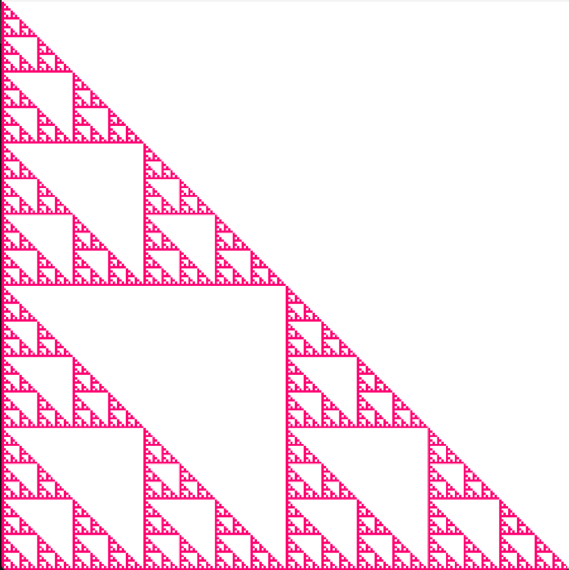
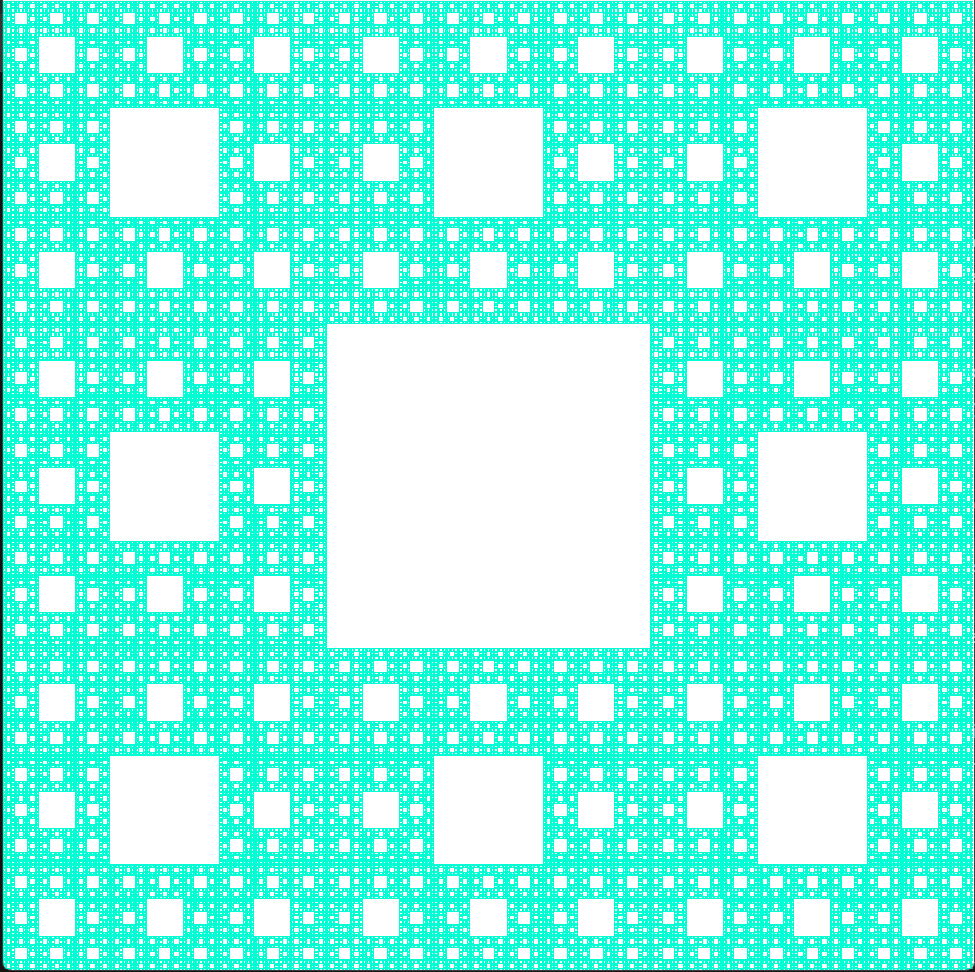
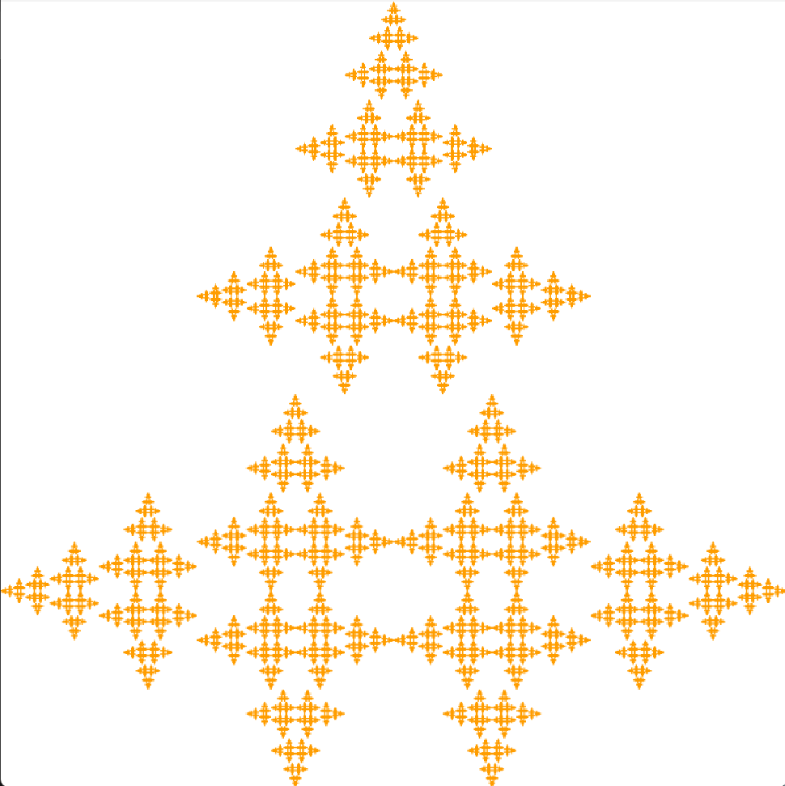

## IFS Fractal Generator

### Software Used
- Windows 10/11
- JDK-21
- Visual Studio Code

### Controls
- Press 1-9 to select different IFS tables
- Press Enter to continue to the next iteration of the fractal generation
- Press Backspace to reset
- Press 0 to change color to random (a new random color will be selected after each reset)
- Press C to change starting image to a circle
- Press S to change starting image to a square
- Press T to change starting image to a triangle
- Press R to change starting image to a random collection of polygons
- Press P to reset color to blue

### Examples

